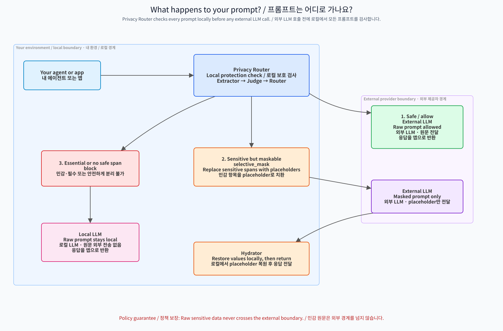

# Privacy Router


<p align="center">
  <strong>Privacy-first Model Router for Universal Agent Runtime</strong>
</p>

<p align="center">
  <a href="https://youtu.be/tX8oVv5DlAs"></a>
  <a href="paper/report_en.pdf"></a>
  

</p>

## Team

| Field | Value |
|---|---|
| Team name | DH. Kim & M. Saadati |
| Members | 김동현 (donghyeon@gist.ac.kr), Mohammad Saadati (mohammadsaadati@gm.gist.ac.kr) |
| Supervisor | Prof. Heung-No Lee, GIST |
| Course | Generative AI and Blockchain 2026 |
| Repository | https://github.com/devcomfort/privacy-router |

## Project Type

**Primary:** Privacy-Preserving AI Service
**Secondary:** Cost-Efficient AI Stack

---

## Problem Statement & Target User

LLM agents send every user prompt to external cloud APIs. These prompts routinely contain:

- **PII:** Resident registration numbers, phone numbers, email addresses, medical records
- **Business secrets:** internal decisions, project codenames, financial figures, M&A plans
- **Research secrets:** unpublished ideas, experimental results, novel architectures

Existing solutions are inadequate:

- **OpenAI Content Filter / Microsoft Presidio:** keyword/regex-based, English-centric — miss Korean RRN (`<personal-id>`), +82 phone numbers, and contextual secrets
- **On-device models:** lose cloud LLM quality for every query, even safe ones
- **Manual review:** impossible at agent speed (sub-second decisions needed)

**Privacy Router** is a transparent proxy middleware that intercepts agent prompts, classifies sensitivity through contextual reasoning (not keywords), masks sensitive spans, and routes each request — keeping sensitive data local while safe queries get full cloud quality.

```
Agent → [Privacy Router] → External LLM (safe queries only)
                ↓
         Local LLM (sensitive queries)
```

---

## Installation & Execution

### 1. Start the Server

Requires Python 3.13+. The default local Gemma 4 26B service also requires Docker, the NVIDIA Container Toolkit, and at least 64 GB of available accelerator or unified memory.

```bash
git clone https://github.com/devcomfort/privacy-router.git
cd privacy-router
cp .env.example .env
python -m pip install -e .
```

For a loopback-only demo, start the single local inference service, then launch the app in another terminal:

```bash
./scripts/start_vllm.sh gemma4
# second terminal
privacy-router dev
```


The first model start downloads Gemma 4 26B into `${HF_CACHE:-$HOME/.cache/huggingface}`. The base package intentionally excludes GPU, experiment, and report-generation libraries; install `.[local-inference]`, `.[experiments]`, or `.[reports]` only for the corresponding developer workflows.
`dev` creates a short-lived browser session automatically, requires no client API key, and never selects an external model. For deployment, set `PRIVACY_ROUTER_MASTER_KEY`, `PRIVACY_ROUTER_ADMIN_PASSWORD`, and each provider environment variable such as `OPENROUTER_API_KEY`, then run:

```bash
docker compose up -d
# equivalent process entry point: privacy-router serve
```

Docker Compose starts the API on `http://localhost:8787`, PostgreSQL on port 5433, and Hermes Agent on port 7860. Published ports bind to `127.0.0.1` by default. Compose permits the administrator password exchange over HTTP only for this loopback-published setup; if `PRIVACY_ROUTER_BIND_HOST` is changed, set `PRIVACY_ROUTER_ALLOW_INSECURE_ADMIN=0` and terminate HTTPS before the API.

### 2. Create a Client API Key

Open http://localhost:8787/admin and enter `PRIVACY_ROUTER_ADMIN_PASSWORD`.

1. Click **"Create Key"**
2. Enter a name (for example, `my-app`)
3. Copy the generated `pr-...` key; it is shown only once

The password is exchanged for a short-lived `HttpOnly`, `SameSite=Strict` session cookie. State-changing management requests also require the session's CSRF token. Provider credentials are not editable in the UI or stored in SQLite; rotate them through server environment variables and restart the service.

### 3. Configure Your Agent

| Setting | Value |
|---------|-------|
| **API Base URL** | `http://localhost:8787/v1` |
| **API Key** | `pr-xxxxxxxxxxxx` (your key from step 2) |
| **Model** | `openrouter/mistralai/ministral-3b-2512` (or any supported model) |

The proxy is **OpenAI-compatible** — just change `base_url`. No code changes needed.

### 4. Test It

```bash
export API_KEY="pr-xxxxxxxxxxxx"

# Safe prompt → passes through unchanged
curl http://localhost:8787/v1/chat/completions \
  -H "Authorization: Bearer $API_KEY" \
  -H "Content-Type: application/json" \
  -d '{
    "model": "openrouter/mistralai/ministral-3b-2512",
    "messages": [{"role": "user", "content": "What is the capital of France?"}]
  }'

# Sensitive topic prompt (runnable; no concrete identifier) → detected and blocked
curl http://localhost:8787/v1/chat/completions \
  -H "Authorization: Bearer $API_KEY" \
  -H "Content-Type: application/json" \
  -d '{
    "model": "openrouter/mistralai/ministral-3b-2512",
    "messages": [{"role": "user", "content": "내 주민등록번호가 뭐야?"}]
  }'
```

Mask-and-forward examples in the docs use placeholders such as `<personal-id>`; they are illustrative and are not copy-paste detector fixtures. Do not paste real identifiers into public demos.

### Conversation Context

Both `/v1/chat/completions` and `/v1/responses` analyze every text-bearing field in the current request: system, user, and assistant messages; tool definitions and tool results; Responses `input`; and `instructions`. Responses requests support function tools; unsupported tool types fail with `400` before any provider call. Provider results are returned as OpenAI-compatible chat objects or OpenResponses message/function-call items and streaming events.

Clients may send either a complete transcript or only the latest-turn delta. Supply the same `X-Chat-ID` header to retain encrypted conversation context between requests. New values replace matching singleton fields such as `instructions` and tool definitions; new conversation turns are appended; identical snapshot segments are deduplicated. Persistence is atomic for concurrent requests. The opaque cache key combines the authenticated API-key identity with the client conversation ID, so two tenants cannot share context accidentally. Omit `X-Chat-ID` for stateless requests. Conversation IDs must contain 1–512 UTF-8 bytes.

Only extraction records from the current request may appear in response privacy metadata. Persisted prior context and internal extractor reasoning are never echoed.

### 5. Try with Hermes Agent

```bash
docker exec privacy-router-hermes-1 hermes -z "안녕하세요" --accept-hooks
docker exec privacy-router-hermes-1 hermes -z "내 주민등록번호가 뭐야?" --accept-hooks
```

---

## How It Works: Extractor → Judge → Router



<!-- 2026-08-28: Plan only; no runtime implementation change. -->
## Planned Component Replacement

This section records future work only. The current runtime remains unchanged
until the new detector components, parsers, normalizer, token handling, and
unit tests are complete.

1. Replace the current `ExtractorCore`/`Extractor`/`Critic` path with a
   backend-independent extraction contract implemented by the LiteLLM-backed
   LLM extractor, Presidio, OpenAI Privacy Filter, and LFM2.5 adapters.
2. Retire the current `Judge`, `Router`, and `MiddleMan` components after the
   replacement pipeline is complete. They are deterministic heuristic policy
   and execution code, not autonomous agents.
3. Revisit the policy and routing layer after extraction and masking work is
   complete, using the separate task/privacy/cost routing design rather than
   preserving the current heuristic component boundaries.
4. Remove obsolete compatibility fields, callers, tests, and documentation in
   the same cutover; do not maintain two competing runtime contracts.

No Judge or Router implementation is changed by this plan entry. Reassess
this section only after the new component suite and its unit tests are green.


### Detection Examples

**Contextual detection (our strength):**

Input: "삼성전자 차세대 AP 개발 건으로, TSMC 3nm 공정을 채택하기로 내부적으로 결정했다."

```json
[
  {"category": "COMPANY_PROJECT_NAME", "span": "삼성전자 차세대 AP 개발 건", "confidence": 0.91},
  {"category": "FABRICATION_PROCESS_DECISION", "span": "TSMC 3nm 공정을 채택하기로", "confidence": 0.94},
  {"category": "INTERNAL_BUSINESS_DECISION", "span": "내부적으로 결정", "confidence": 0.92}
]
```

No keyword like "secret" or "confidential" appears — but the system understands this is a business secret.

---

## Differentiation vs Big-Tech Assistants

| Solution | Approach | Multilingual PII | Contextual Secrets | On-Device |
|----------|----------|-----------------|-------------------|-----------|
| **OpenAI Privacy Filter** | Fixed 8-category taxonomy | ❌ English-centric | ❌ No contextual understanding | ❌ Cloud-only |
| **Azure AI Content Safety** | Pattern-based DLP (8 core languages) | ❌ Limited coverage | ❌ Pattern matching only | ❌ Cloud-only |
| **Cloudflare AI Gateway** | Pattern-based DLP + guardrails | ❌ Text-only, no MCP/tool visibility | ❌ No semantic analysis | ❌ Edge proxy |
| **Privacy Router** | Socratic contextual reasoning | ✅ Multilingual (Korean, Japanese, Chinese, etc.) | ✅ Meaning-based detection | ✅ On-device |

### Key Limitations of Big Tech Solutions

1. **OpenAI Privacy Filter**: Fixed 8-category taxonomy (names, addresses, emails, etc.) — cannot detect business secrets, research ideas, or non-English identifiers without fine-tuning. ~98% recall means ~2% of PII is missed. English-centric; non-English performance is lower and undocumented. ([Source](https://platform.openai.com/docs/guides/safety-best-practices))

2. **Azure AI Content Safety**: Core models trained on 8 languages (en, zh, fr, de, es, it, ja, pt) — Korean and other Asian languages not in core. No country-specific PII formats. Returns no entities for unsupported languages. ([Source](https://learn.microsoft.com/en-us/azure/ai-services/content-safety/overview))

3. **Cloudflare AI Gateway**: Pattern-based DLP scanning on text only — cannot inspect base64-encoded files, MCP tool arguments, or WebSocket/DNS channels. Logs reside in Cloudflare infrastructure. Core features free (100K logs/month). ([Source](https://developers.cloudflare.com/ai-gateway/))

### Privacy Router Advantages

| Advantage | Evidence |
|-----------|----------|
| **Multilingual PII detection** | Pattern + contextual reasoning across multiple languages |
| **Contextual secret detection** | Business secrets, research ideas via Socratic reasoning (62.5% accuracy) |
| **Local-first routing** | Sensitive data never leaves the device — routes to local LLM |
| **Cost efficiency** | $0.075/month (see Cost section) vs OpenAI $10+/month, Azure $50+/month |
| **OpenAI-compatible proxy** | Drop-in replacement — just change `base_url` |
| **Socratic categories** | Free-form `SCREAMING_CASE` tags — not limited to fixed taxonomy |

---

## 7-Day Usage Log

46 real API calls through Hermes Agent during live demo sessions (2026-06-17). 67.4% contained sensitive information.

| Date | Total | Sensitive | Safe | Local | Masked |
|------|------:|----------:|-----:|------:|-------:|
| 2026-06-17 | 46 | 31 | 15 | 9 | 22 |

**Key finding:** Two-thirds of agent-generated prompts contain sensitive information that would leak to external APIs without Privacy Router.

Full logs: [`usage-log/USAGE_LOG.md`](usage-log/USAGE_LOG.md) · [`usage-log/db-logs.json`](usage-log/db-logs.json)

---

## Cost Estimate & Local/Cloud Stack

### Three Runtime Model Roles

| Runtime role | Where | Current model | Responsibility | Marginal API cost |
|---|---|---|---|---:|
| Decision Model | On-device | Gemma 4 26B | Sensitivity, exact-span, category, and `is_essential` structured output | $0 |
| Local Model | On-device | Gemma 4 26B | Generate from essential-sensitive raw prompts through the same local endpoint | $0 |
| External Model | Cloud | OpenRouter Gemma 4 26B | Generate from non-sensitive or validated masked prompts | provider rate |
| Judge / Router | On-device code | No LLM | Deterministic policy and execution-path selection | $0 |

ExtractorCore and the optional high-precision Critic both execute with the Decision Model. They are analysis components, not independently selectable model roles.

### Routing Cost Model

- **Non-sensitive queries** → External Model
- **Sensitive + maskable** → placeholder masking → External Model → local hydration
- **Sensitive + essential** → Local Model; raw content stays on-device
- **Blocked or unresolved failures** → no model call

Only External Model tokens incur provider charges. The total depends on the external-route ratio, prompt and response length, and the configured OpenRouter price. See [`docs/user/cost.md`](docs/user/cost.md) for the calculation and [`docs/experiments/eval-report.md`](docs/experiments/eval-report.md) for historical model evaluations.


---

## Privacy & Security Summary

### Threat Model

| Threat | Mitigation |
|--------|-----------|
| PII leakage to cloud LLM | Automatic extraction + request-scoped random placeholder masking before external API calls |
| Business secret exposure | Contextual Socratic detection — no keyword dependency |
| Masking reversal by cloud LLM | `CATEGORY#random8` placeholders carry no value-derived hash and resolve only through the encrypted local contract |
| Man-in-the-middle on API calls | HTTPS for all external connections; local traffic on localhost |
| Database raw-data exposure | Fernet encryption for extraction context, masking spans, and stored responses; 24-hour TTL with physical cleanup; provider credentials never enter the database |
| Unauthorized management changes | Administrator password exchange, short-lived `HttpOnly` session cookie, and CSRF token on state-changing requests |
| Multi-turn context leakage | Sliding-window session memory keeps masking decisions consistent |

### Data Flow

```text
Agent Prompt
    ↓
ExtractorCore / optional Critic
    ↓  Decision Model: local Gemma 4 26B
Rule-based Judge → deterministic Router
    ├── non-sensitive or masked ──→ External Model: OpenRouter Gemma 4 26B
    ├── essential-sensitive ──────→ Local Model: local Gemma 4 26B
    └── unresolved failure ───────→ Block
```

- **Data flow**: Sensitive information is never sent to external APIs (masking or local processing)
- **Encryption**: Fernet (AES-128-CBC + HMAC-SHA256) for stored sensitive records; provider credentials remain environment-only
- **Masking**: `CATEGORY#random8` placeholders replace sensitive spans; originals never leave the device
- **Hydration**: Placeholders are restored to original values in responses

Threat model: [`docs/user/security.md`](docs/user/security.md)

---

## Smartening: Socratic Extraction + Two-Phase Review

We implemented **Socratic extraction with Critic review** (Week 11 smartening: self-reflection / critic pattern):

High-precision mode adds a second review pass with the same local Decision Model:

- **Phase 1 (Extract):** contextual reasoning detects sensitive spans and derives descriptive `SCREAMING_SNAKE_CASE` categories.
- **Phase 2 (Critic):** an optional second pass reviews missed spans and `is_essential` classification.
- **Merge:** hallucination filtering keeps only spans that occur verbatim in the original text.

Measured model and prompt comparisons remain in [`docs/experiments/eval-report.md`](docs/experiments/eval-report.md); this product overview does not generalize those experiment-specific results.


## Architecture

| Component | Technology / binding |
|---|---|
| ExtractorCore + optional Critic | Decision Model: local Gemma 4 26B |
| Judge | Rule-based Python; no LLM |
| Router | Deterministic Python; no LLM |
| Local generation | Local Gemma 4 26B |
| External generation | OpenRouter Gemma 4 26B |
| Backend | FastAPI + SQLModel |
| Database | SQLite (dev) / PostgreSQL (prod) |
| Frontend | SvelteKit (SSG) |
| Encryption | Fernet (AES-128-CBC + HMAC-SHA256) |
| Integration | OpenAI-compatible API + MCP Server |

Detailed architecture: [`docs/dev/architecture.md`](docs/dev/architecture.md)

---

## I = M × HBM × R (Technical Rigour)

Privacy Router keeps analysis and generation as separate trust-boundary workloads:

| Workload | Deployment | Why |
|---|---|---|
| Decision Model: Gemma 4 26B | Local OpenAI-compatible endpoint | Every raw prompt is classified locally before any external request |
| Local Model: Gemma 4 26B | Same local endpoint | Essential-sensitive generation reuses the resident model without crossing the trust boundary |
| External Model: OpenRouter Gemma 4 26B | Cloud | High-quality generation only after the request is safe or placeholder-masked |

The runtime schema validates the model registry against these boundaries: Decision and Local must resolve to `location: local`; External must resolve to `location: external`. The SQLite profile stores only these three role bindings. Judge and Router add no inference workload.


---

## Docs

| Document | Description |
|---|---|
| [`docs/user/getting-started.md`](docs/user/getting-started.md) | Installation, configuration, first API call |
| [`docs/dev/architecture.md`](docs/dev/architecture.md) | Pipeline, model bindings, components, and trust boundaries |
| [`docs/user/detection.md`](docs/user/detection.md) | Socratic sensitivity detection and exact-span examples |
| [`docs/user/security.md`](docs/user/security.md) | Threat model, encryption, and data retention |
| [`docs/user/cost.md`](docs/user/cost.md) | Cost calculation and optimization |
| [`docs/experiments/eval-report.md`](docs/experiments/eval-report.md) | Historical model evaluation |

---

## Testing

This project has **two test suites**, each designed for a different purpose.

### Suite 1: Unit Tests (`agents/*/tests/`)

**Purpose**: Verify code structure and logic (mock-based)

```bash
python3 -m pytest agents/extractor/tests/ agents/judge/tests/ agents/router/tests/ -v
```

| What | How | Example |
|------|-----|---------|
| Pipeline structure | mock | Extractor → Judge → Router paths |
| Validation logic | deterministic | SCREAMING_CASE, confidence ≥ 0.5 |
| Masking/hydration | mock LLM calls | span → placeholder → restore |
| Policy decisions | deterministic | is_essential → policy_action |
| Error handling | mock exception | LLM failure fallback |

- **When**: Every commit, CI
- **Duration**: ~30 seconds
- **Deterministic**: ✅ (same result guaranteed)

### Suite 2: Eval Suite (`scripts/eval_runner.py`)

**Purpose**: Verify LLM output quality (real LLM calls)

```bash
python3 scripts/eval_runner.py --model gemma4-e4b-vllm --trials 5
python3 scripts/eval_runner.py --report
```

Raw trial inputs, spans, prompts, and model responses are written to `var/evaluations/runner/` and ignored by Git. Public documentation retains aggregate-only summaries.

| What | How | Metric |
|------|-----|--------|
| Sensitivity detection | N≥5 trials | Sensitivity Accuracy |
| Policy decisions | N≥5 trials | Action Accuracy |
| Pattern-based PII | Pattern cases | PII, phone, email |
| Contextual secrets | Context cases | Business secrets, research ideas |
| JSON output | N≥5 trials | JSON Validity |
| Statistical significance | paired t-test | p < 0.05 |

- **When**: Model changes, tuning, prompt edits
- **Duration**: Minutes to tens of minutes
- **Deterministic**: ⚠️ (varies with LLM)

### Why Two Suites?

```
Unit tests (mock)           Eval suite (real LLM)
  → "Is the code correct?"    → "Is the LLM correct?"
  → Fast and stable            → Slow but realistic
  → Run every commit           → Run on model/tuning changes
  → Detect code bugs           → Measure LLM quality
```

Without mocks, test failures cannot distinguish between "code bug" and "LLM variance."

---

## Repository Structure

```
privacy-router/
├── agents/                  # Extractor, Judge, Router, Masker
├── server/                  # FastAPI server + MCP tools
├── db/                      # SQLModel database layer
├── web/                     # SvelteKit frontend (SSG)
├── eval/                    # Evaluation package
├── slides/                  # HTML presentations + PDF/PPTX
├── paper/                   # TeX research paper
├── usage-log/               # Real usage logs (46 entries)
├── docs/                    # Documentation
├── test_data/               # Multi-turn test conversations
```

## Access Points

| URL | Description |
|-----|-------------|
| http://localhost:8787/ | Landing page (EN/KO) |
| http://localhost:8787/admin | Model, API key, and redacted telemetry management |
| http://localhost:8787/demo | Interactive chat demo |
| http://localhost:8787/docs | Product documentation |
| http://localhost:9119 | Hermes Agent dashboard |
| http://localhost:8787/api/docs | OpenAPI Swagger UI |

---

## Demo Video

**YouTube:** https://youtu.be/tX8oVv5DlAs (5 minutes)

Demonstrates: real-time PII detection, business secret classification, masking/routing decisions, and admin dashboard visibility through Hermes Agent.

---

## Paper & Slides

| Document | Language | Link |
|----------|----------|------|
| Paper | English | [`paper/report_en.pdf`](paper/report_en.pdf) |
| Paper | Korean | [`paper/report_ko.pdf`](paper/report_ko.pdf) |
| Slides | English | [`slides/presentation_en.html`](slides/presentation_en.html) |
| Slides | Korean | [`slides/presentation_kr.html`](slides/presentation_kr.html) |

---

## License

This repository currently has **no open-source license**. Source availability does not grant permission to use, copy, modify, or redistribute it; contact the team for permission.

---

## Contact

- **DH. Kim** — donghyeon@gist.ac.kr
- **M. Saadati** — mohammadsaadati@gm.gist.ac.kr
- **Supervisor:** Prof. Heung-No Lee, GIST

---
